# Godot Asset Generator — Workflow and Provider Comparison


## 1. Project overview

A Godot editor plugin that turns a text prompt into a game-ready pixel-art asset without leaving the editor. The user types "a healing potion" (optionally with a size and a target game style); the asset is generated, post-processed into clean pixels, and saved into the project's asset folder.

Two halves:

- **Frontend** — a Godot `EditorPlugin` in GDScript (`addons/vibe_agent/vibe_plugin.gd`, registered via `plugin.cfg`). Draws the editor panel, collects the prompt and parameters, and calls the backend over local HTTP.
- **Backend** — a Python FastAPI service that does the work: interpret the prompt, call an image-generation provider, post-process the result. Runs at `127.0.0.1:8000`.

The backend is being rewritten as **v2**, organized so each step is a small module with a single responsibility. The workflow below describes the v2 logic.

---

## 2. Workflow

### 2.1 End-to-end path

```
Artist in Godot editor
   │  types prompt (+ size, style, provider)
   ▼
GDScript plugin ──HTTP──► FastAPI backend (127.0.0.1:8000)
                              │
                              ▼
     Request        raw user input (prompt, size, folder, style, provider)
                              │
                              ▼
     route()        infer the asset type from the prompt → pick an Asset class
                              │
                              ▼
     build_plan()   the Asset turns the Request into a Plan
                              │
                              ▼
     Plan           data contract: size, output folder, flags (needs_compose, …)
                              │
                              ▼
     generate()     the chosen Provider calls its image API with the Plan
                              │
                              ▼
     compose + post-process   stitch (if needed), downscale, palette snap
                              │
                              ▼
     save           write PNG to the project's asset folder
                              │
                   ◄──── response ────┘
   │
   ▼
Asset appears in Godot, ready to use
```

### 2.2 Step by step (v2)

1. **Request** — the plugin's HTTP payload becomes a `Request`: prompt, size, output folder, style, provider. It only stores the input; it does not interpret it.
2. **route()** — decides the asset type. This is **layer 1: deterministic keyword matching** — the prompt is checked against a keyword table (icon, block, ground/tile, spritesheet, scene …) and the corresponding `Asset` class is returned. Selection happens once here, through a lookup, so no other step branches on type. It is deliberately not the whole story: type-*naming* words ("block", "spritesheet", "tileset") lock the type here; ambiguous *content* words ("a wooden treasure chest", "a cozy tavern") are left for layer 2. When nothing matches, it defaults to `icon` as fallback.
3. **build_plan()** — the selected `Asset` converts the `Request` into a `Plan`. This is where **layer 2: the LLM** can enter — *only* when the caller left the type on `auto` and layer 1 did not lock it. The LLM makes the semantic guess a keyword table can never cover (chest → icon, tavern → scene) and, in the same call, fills the rest of the `Plan` (refined description, size, flags). It is optional and fail-safe: if it is unavailable or errors, a deterministic fallback `Plan` is used. A type-naming keyword from layer 1 still overrides the LLM's guess. See 4.2–4.3 for the full logic.
4. **Plan** — the single data contract every downstream step reads: target size, output folder, and flags such as `needs_compose` / `use_style_transfer`.
5. **generate()** — the `Provider` named in the request (PixelLab, OpenAI, …) is looked up in a table and called with the `Plan`. Every provider exposes the same `generate(plan)` signature, so the caller never branches on which provider it is.
6. **compose + post-process** — multi-part assets are stitched; then downscale to the target size and snap the palette (see 5.4). 

Example of the compose step — a block generated as a grass top and a dirt front, stitched into one 32×48 texture:

   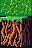

7. **save** — the finished PNG is written to the asset folder and the path is returned to the plugin.

### 2.3 Endpoints

The backend exposes `/vibe/generate` (new asset), `/vibe/modify` (edit an existing asset), `/vibe/automate` (batch/scripted actions), and `/vibe/options` (capabilities the plugin queries at startup).

---

## 3. Provider comparison

### 3.1 The core divide

The single fact that organizes everything below: **native low-resolution generation** (PixelLab) versus **high-resolution generation followed by downscaling** (OpenAI GPT Image).

In the first family the model decides where each pixel sits. In the second, pixel placement is reconstructed by a post-processing pipeline that has to collapse soft, anti-aliased AI color onto a clean grid. At 16–24 px this divide dominates every other consideration, because a 24×24 tile is only 576 pixels, any smear or leftover in-between color has nowhere to hide.

### 3.2 Providers under test

| Provider | Kind | Native size capability | Status |
| --- | --- | --- | --- |
| **PixelLab** | Pixel-art-specific API | Renders directly at small target sizes (16/32, etc.) | Integrated |
| **OpenAI GPT Image** (`gpt-image-1`) | General-purpose | Emits only 1024×1024 / 1024×1536 / 1536×1024; must be downscaled | Integrated |

### 3.3 Per-provider analysis

For each provider: what it does well, and argued from evidence, where it falls short. The recommendations follow from these limitations, not from a single score.

#### PixelLab

**Strengths.** Renders natively at the target resolution, so pixel placement is decided by the model, not by downscaling. Edges land on-grid and the palette is already tight, which means minimal post-processing and the most predictable behavior at 16–24 px.

**Limitations.**

- *Low texture information density.* In the forest-ground example (see 3.5) the PixelLab tile is dark, low-frequency, and blobby — clean pixels but little material detail. Fine for a hero prop; flat for a ground texture that must tile and carry surface interest.
- *Narrow stylistic range.* Pixel-specialization is a double edge: outputs converge on one "correct" pixel look and are harder to push toward a specific game's art direction (Terraria's high-contrast dithering vs Core Keeper's soft internal glow). Style must be coaxed through prompt wording.
- *Weakest where general models are strongest.* At scene scale (640×360), where composition and palette richness matter more than per-pixel grid discipline, the small-size specialization stops being an advantage.
- *Hard 400 px resolution ceiling.* The PixelLab API rejects any dimension above 400 px (a 640-wide request returns HTTP 422). It therefore **cannot render the 640×360 scene target at all** — the largest same-aspect scene it can produce is 400×224. This is a firm capability gap at scene scale, not a quality judgement: for a full 640×360 concept scene PixelLab is simply out of range, and the comparison in that row is between a true 640×360 (OpenAI) and PixelLab's 400×224 ceiling.

**Takeaway:** default for small icons/characters where grid-clean edges dominate; suspect for high-detail textures, and unavailable above 400 px, which rules it out for full-resolution scenes.

#### OpenAI GPT Image (`gpt-image-1`)

**Strengths.** Strong prompt understanding and rich, varied output; the forest-ground example (3.5) shows denser grass grain and a brighter, more materially convincing surface than PixelLab. Good stylistic range for scenes and references.

**Limitations.**

- *No native small size — everything is a downscale.* The model only emits 1024-class images (sizes forced to 1024×1024 / 1024×1536 / 1536×1024). Every 16/24/32 asset is a large image squeezed down, so final quality is hostage to the downscale + palette-snap pipeline, not the model's own pixels.
- *Soft intermediate colors.* An anti-aliased source carries AI in-between colors that must be quantized away (`MEDIANCUT`). Without that step the palette is not pixel-clean; with it, fine detail is the first thing lost. This is the central weakness at 24 px.
- *Aspect-ratio coarseness.* Only three coarse aspect ratios, so non-matching targets are cropped or stretched before downscaling — extra edge damage for characters and odd tile shapes.
- *Cost and latency.* A full 1024 render per 24×24 tile is expensive and slow versus a native small-size call — a real concern for batch atlas generation.

**Takeaway:** strong for scenes and style references at 640×360; structurally handicapped at 16–24 px, where quality is capped by the downscaling pipeline rather than the model.

### 3.4 Result grid — `provider × asset type × size`

Same prompt per row, only the size and provider change. Images are shown **upscaled ×8 (nearest-neighbor)** for legibility — the true asset sizes are as labeled (16/24/32 px, etc.); scenes are at native size.

**Tile — 16×16**

| PixelLab | OpenAI GPT Image |
| --- | --- |
| 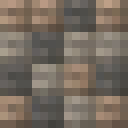 | 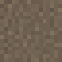 |

**Tile — 24×24 (tentative tile size)**

| PixelLab | OpenAI GPT Image |
| --- | --- |
| 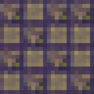 | 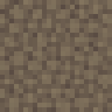 |

**Tile — 32×32**

| PixelLab | OpenAI GPT Image |
| --- | --- |
| 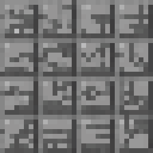 | 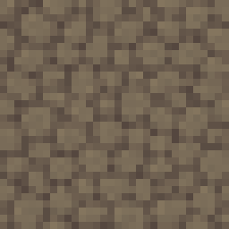 |

**Character — 32×32**

| PixelLab | OpenAI GPT Image |
| --- | --- |
| 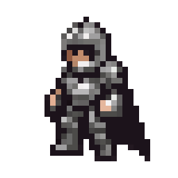 | 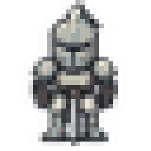 |

**Character — 36×36**

| PixelLab | OpenAI GPT Image |
| --- | --- |
| 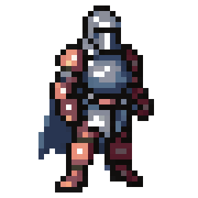 | 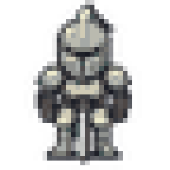 |

**Scene — 640×360** (PixelLab capped at its 400 px ceiling → 400×224; OpenAI at the true target)

| PixelLab (400×224, max) | OpenAI GPT Image (640×360) |
| --- | --- |
| 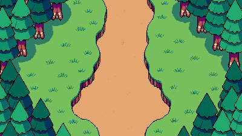 | 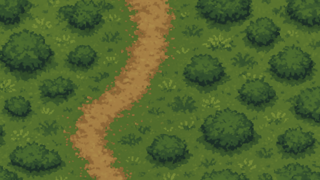 |

### 3.5 Existing head-to-head examples

These are real artifacts from earlier runs. Sizes are not aligned to the targets above (128×128 and 64×64), so they illustrate quality character only, not the formal comparison.

**Forest ground texture, 128×128:**

| PixelLab | OpenAI GPT Image |
| --- | --- |
| 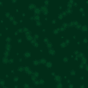 | 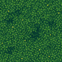 |

The PixelLab tile is darker, low-frequency, and blobby — clean pixels but sparse texture. The OpenAI tile is brighter with dense grass grain and richer detail, but retains AI in-between colors unless the palette-snap step is applied. This one pair is the §3.1 divide made visible.

**High-resolution style reference, 1024×1024** (the kind of rich, full-resolution source a general model produces before downscaling — it is exactly this density that must survive the squeeze to a 24 px tile):

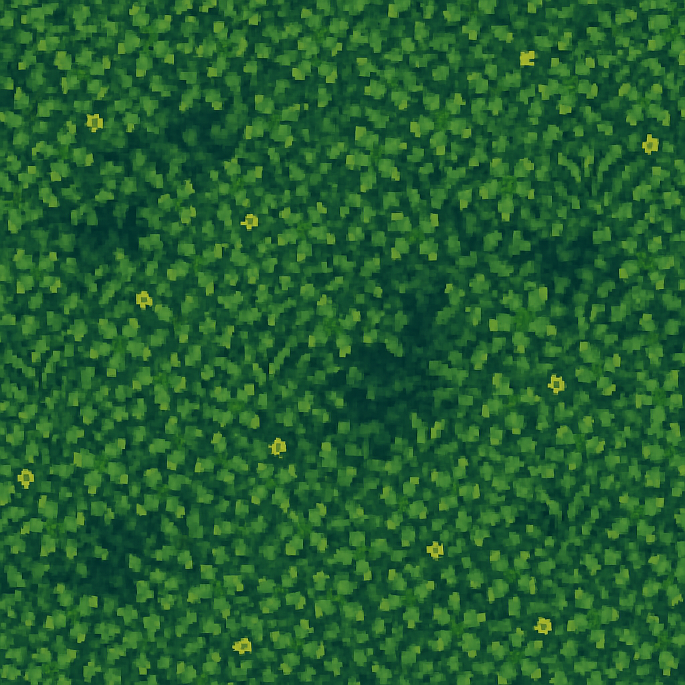

**OpenAI GPT Image 1024×1024 sources** (the model emits only 1024-class output, so every small OpenAI asset in 3.4 starts as one of these and is then downscaled — this is the "high-resolution then downscale" half of 3.1 shown directly):

| Tile source | Character source |
| --- | --- |
| 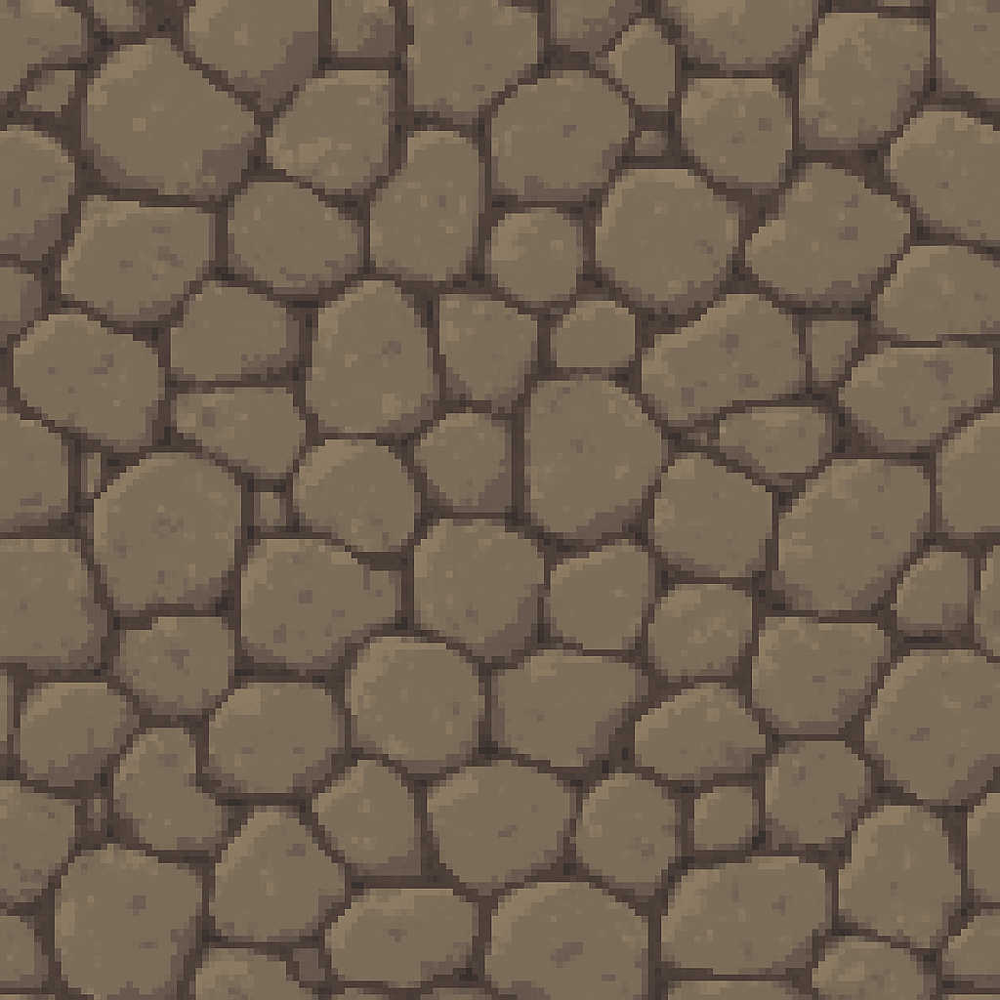 | 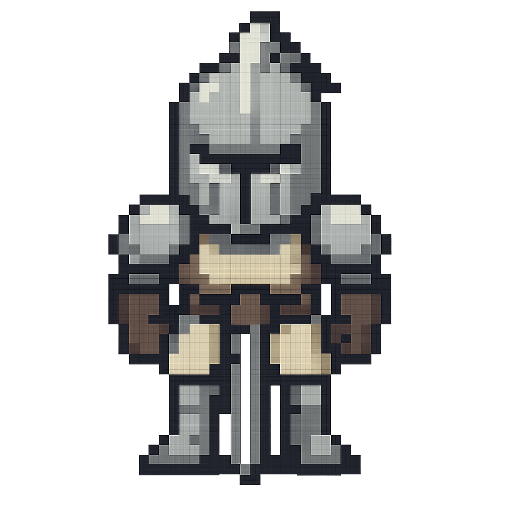 |

**Style benchmark, PixelLab, 64×64** (same item, three style constraints — Core Keeper / Minecraft / Terraria):

| Item | Core Keeper | Minecraft | Terraria |
| --- | --- | --- | --- |
| Iron Sword | 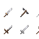 | 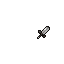 |  |
