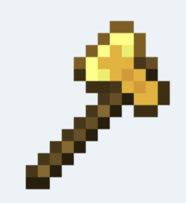

# Godot Asset Generator — Workflow and Provider Comparison


## 1. Project overview

A Godot editor plugin that turns a text prompt into a game-ready pixel-art asset without leaving the editor. The user types "a healing potion" (optionally with a size and a target game style); the asset is generated, post-processed into clean pixels, and saved into the project's asset folder.

Two halves:

- **Frontend** — a Godot `EditorPlugin` in GDScript (`addons/vibe_agent/vibe_plugin.gd`, registered via `plugin.cfg`). Draws the editor panel, collects the prompt and parameters, and calls the backend over local HTTP.
- **Backend** — a Python FastAPI service that does the work: interpret the prompt, call an image-generation provider, post-process the result. Runs at `127.0.0.1:8000`.

The backend is being rewritten as **v2**, organized so each step is a small module with a single responsibility. The workflow below describes the v2 logic.

---

## 2. Workflow

### 2.1 End-to-end path

```
Artist in Godot editor
   │  types prompt (+ size, style, provider)
   ▼
GDScript plugin ──HTTP──► FastAPI backend (127.0.0.1:8000)
                              │
                              ▼
     Request        raw user input (prompt, size, folder, style, provider)
                              │
                              ▼
     route()        infer the asset type from the prompt → pick an Asset class
                              │
                              ▼
     build_plan()   the Asset turns the Request into a Plan
                              │
                              ▼
     Plan           data contract: size, output folder, flags (needs_compose, …)
                              │
                              ▼
     generate()     the chosen Provider calls its image API with the Plan
                              │
                              ▼
     compose + post-process   stitch (if needed), downscale, palette snap
                              │
                              ▼
     save           write PNG to the project's asset folder
                              │
                   ◄──── response ────┘
   │
   ▼
Asset appears in Godot, ready to use
```

### 2.2 Step by step (v2)

1. **Request** — the plugin's HTTP payload becomes a `Request`: prompt, size, output folder, style, provider. It only stores the input; it does not interpret it.
2. **route()** — decides the asset type. This is **layer 1: deterministic keyword matching** — the prompt is checked against a keyword table (icon, block, ground/tile, spritesheet, scene …) and the corresponding `Asset` class is returned. Selection happens once here, through a lookup, so no other step branches on type. It is deliberately not the whole story: type-*naming* words ("block", "spritesheet", "tileset") lock the type here; ambiguous *content* words ("a wooden treasure chest", "a cozy tavern") are left for layer 2. When nothing matches, it defaults to `icon` as fallback.
3. **build_plan()** — the selected `Asset` converts the `Request` into a `Plan`. This is where **layer 2: the LLM** can enter — *only* when the caller left the type on `auto` and layer 1 did not lock it. The LLM makes the semantic guess a keyword table can never cover (chest → icon, tavern → scene) and, in the same call, fills the rest of the `Plan` (refined description, size, flags). It is optional and fail-safe: if it is unavailable or errors, a deterministic fallback `Plan` is used. A type-naming keyword from layer 1 still overrides the LLM's guess. See 4.2–4.3 for the full logic.
4. **Plan** — the single data contract every downstream step reads: target size, output folder, and flags such as `needs_compose` / `use_style_transfer`.
5. **generate()** — the `Provider` named in the request (PixelLab, OpenAI, …) is looked up in a table and called with the `Plan`. Every provider exposes the same `generate(plan)` signature, so the caller never branches on which provider it is.
6. **compose + post-process** — multi-part assets are stitched; then downscale to the target size and snap the palette (see 5.4). 

Example of the compose step — a block generated as a grass top and a dirt front, stitched into one 32×48 texture:

   

7. **save** — the finished PNG is written to the asset folder and the path is returned to the plugin.

### 2.3 Endpoints

The backend exposes `/vibe/generate` (new asset), `/vibe/modify` (edit an existing asset), `/vibe/automate` (batch/scripted actions), and `/vibe/options` (capabilities the plugin queries at startup).

---

## 3. Provider comparison

### 3.1 The core divide

The single fact that organizes everything below: **native low-resolution generation** (PixelLab) versus **high-resolution generation followed by downscaling** (OpenAI GPT Image).

In the first family the model decides where each pixel sits. In the second, pixel placement is reconstructed by a post-processing pipeline that has to collapse soft, anti-aliased AI color onto a clean grid. At 16–24 px this divide dominates every other consideration, because a 24×24 tile is only 576 pixels, any smear or leftover in-between color has nowhere to hide.

### 3.2 Providers under test

| Provider | Kind | Native size capability | Status |
| --- | --- | --- | --- |
| **PixelLab** | Pixel-art-specific API | Renders directly at small target sizes (16/32, etc.) | Integrated |
| **OpenAI GPT Image** (`gpt-image-1`) | General-purpose | Emits only 1024×1024 / 1024×1536 / 1536×1024; must be downscaled | Integrated |

### 3.3 Per-provider analysis

For each provider: what it does well, and argued from evidence, where it falls short. The recommendations follow from these limitations, not from a single score.

#### PixelLab

**Strengths.** Renders natively at the target resolution, so pixel placement is decided by the model, not by downscaling. Edges land on-grid and the palette is already tight, which means minimal post-processing and the most predictable behavior at 16–24 px.

**Limitations.**

- *Low texture information density.* In the forest-ground example (see 3.5) the PixelLab tile is dark, low-frequency, and blobby — clean pixels but little material detail. Fine for a hero prop; flat for a ground texture that must tile and carry surface interest.
- *Narrow stylistic range.* Pixel-specialization is a double edge: outputs converge on one "correct" pixel look and are harder to push toward a specific game's art direction (Terraria's high-contrast dithering vs Core Keeper's soft internal glow). Style must be coaxed through prompt wording.
- *Weakest where general models are strongest.* At scene scale (640×360), where composition and palette richness matter more than per-pixel grid discipline, the small-size specialization stops being an advantage.
- *Hard 400 px resolution ceiling.* The PixelLab API rejects any dimension above 400 px (a 640-wide request returns HTTP 422). It therefore **cannot render the 640×360 scene target at all** — the largest same-aspect scene it can produce is 400×224. This is a firm capability gap at scene scale, not a quality judgement: for a full 640×360 concept scene PixelLab is simply out of range, and the comparison in that row is between a true 640×360 (OpenAI) and PixelLab's 400×224 ceiling.

**Takeaway:** default for small icons/characters where grid-clean edges dominate; suspect for high-detail textures, and unavailable above 400 px, which rules it out for full-resolution scenes.

#### OpenAI GPT Image (`gpt-image-1`)

**Strengths.** Strong prompt understanding and rich, varied output; the forest-ground example (3.5) shows denser grass grain and a brighter, more materially convincing surface than PixelLab. Good stylistic range for scenes and references.

**Limitations.**

- *No native small size — everything is a downscale.* The model only emits 1024-class images (sizes forced to 1024×1024 / 1024×1536 / 1536×1024). Every 16/24/32 asset is a large image squeezed down, so final quality is hostage to the downscale + palette-snap pipeline, not the model's own pixels.
- *Soft intermediate colors.* An anti-aliased source carries AI in-between colors that must be quantized away (`MEDIANCUT`). Without that step the palette is not pixel-clean; with it, fine detail is the first thing lost. This is the central weakness at 24 px.
- *Aspect-ratio coarseness.* Only three coarse aspect ratios, so non-matching targets are cropped or stretched before downscaling — extra edge damage for characters and odd tile shapes.
- *Cost and latency.* A full 1024 render per 24×24 tile is expensive and slow versus a native small-size call — a real concern for batch atlas generation.

**Takeaway:** strong for scenes and style references at 640×360; structurally handicapped at 16–24 px, where quality is capped by the downscaling pipeline rather than the model.

### 3.4 Result grid — `provider × asset type × size`

Same prompt per row, only the size and provider change. Images are shown **upscaled ×8 (nearest-neighbor)** for legibility — the true asset sizes are as labeled (16/24/32 px, etc.); scenes are at native size.

**Tile — 16×16**

| PixelLab | OpenAI GPT Image |
| --- | --- |
|  |  |

**Tile — 24×24 (tentative tile size)**

| PixelLab | OpenAI GPT Image |
| --- | --- |
|  |  |

**Tile — 32×32**

| PixelLab | OpenAI GPT Image |
| --- | --- |
|  |  |

**Character — 32×32**

| PixelLab | OpenAI GPT Image |
| --- | --- |
|  |  |

**Character — 36×36**

| PixelLab | OpenAI GPT Image |
| --- | --- |
|  |  |

**Scene — 640×360** (PixelLab capped at its 400 px ceiling → 400×224; OpenAI at the true target)

| PixelLab (400×224, max) | OpenAI GPT Image (640×360) |
| --- | --- |
|  |  |

### 3.5 Existing head-to-head examples

These are real artifacts from earlier runs. Sizes are not aligned to the targets above (128×128 and 64×64), so they illustrate quality character only, not the formal comparison.

**Forest ground texture, 128×128:**

| PixelLab | OpenAI GPT Image |
| --- | --- |
|  |  |

The PixelLab tile is darker, low-frequency, and blobby — clean pixels but sparse texture. The OpenAI tile is brighter with dense grass grain and richer detail, but retains AI in-between colors unless the palette-snap step is applied. This one pair is the §3.1 divide made visible.

**High-resolution style reference, 1024×1024** (the kind of rich, full-resolution source a general model produces before downscaling — it is exactly this density that must survive the squeeze to a 24 px tile):


**OpenAI GPT Image 1024×1024 sources** (the model emits only 1024-class output, so every small OpenAI asset in 3.4 starts as one of these and is then downscaled — this is the "high-resolution then downscale" half of 3.1 shown directly):

| Tile source | Character source |
| --- | --- |
|  |  |

**Style benchmark, PixelLab, 64×64** (same item, three style constraints — Core Keeper / Minecraft / Terraria):

| Item | Core Keeper | Minecraft | Terraria |
| --- | --- | --- | --- |
| Iron Sword |  |  |  |

---

## 4. Code architecture (v2)

The backend is organized so that adding a game style, an asset type, or a provider means adding a file, not editing a monolith. Module map:

| Module (`server_2/`) | Responsibility |
| --- | --- |
| `request.py` | `Request` dataclass — raw user input. Stores, does not interpret. |
| `router.py` | `route()` — infer asset type from the prompt via a keyword table; return the `Asset` class. |
| `asset.py` | `Asset` base + subclasses; each turns a `Request` into a `Plan` for its type. |
| `plan.py` | `Plan` dataclass — the data contract read by every downstream step. |
| `provider.py` | `Provider` base + subclasses, selected through `PROVIDER_CLASSES`; uniform `generate(plan)`. |
| `pipeline.py` | `Pipeline.run()` — wires `route → build_plan → generate → post-process → save`. |

Post-processing, compose, reference selection, and save are plain functions the pipeline calls (§4.5–§4.6), not class hierarchies — only `Asset`, `Provider`, and the block `Composer` need subclassing. Everything else stays a function; no ceremony where a function does.

Three extension points: **add a style** = add a style pack; **add an asset type** = add an `Asset` subclass + keyword; **add a provider** = add a `Provider` subclass + table entry.

The v2 code is not finished, but the logic each module must carry is already settled — it is the behavior proven in the v1 backend. The sub-sections below specify that logic (the *what*, not yet the final v2 code). Code excerpts go in once v2 is written.

### 4.1 `Plan` data contract

`Plan` is a dataclass — the one object every step after `build_plan` reads. Nothing downstream re-parses the prompt; if a value isn't on the `Plan`, it doesn't exist. Fields:

| Field | Meaning |
| --- | --- |
| `description` | the final text sent to the image API (prompt + style/material/reference cues merged in) |
| `width`, `height` | target size in pixels |
| `output_folder` | where the PNG is written |
| `asset_type` | resolved type (icon / block / ground / spritesheet / scene) |
| `no_background` | request a transparent background (true for icons/sprites, false for textures/scenes) |
| `needs_compose` | multi-part asset — generate several faces and stitch (blocks) |
| `use_style_transfer` | feed a reference image straight into the provider instead of only text |
| `reference_image` | path to the matched reference, when style/reference is in play |

The type-specific fields (`needs_compose`, `use_style_transfer`, `reference_image`) are what let one uniform pipeline serve every asset type without branching: the pipeline reads a flag, it never asks "what type is this."

### 4.2 Routing and asset types — the two layers

Type detection is two layers, cheap first, LLM only if needed.

**Layer 1 — `route()`, deterministic keywords.** No model call. The prompt (lowercased) is tested in priority order; first hit wins:

| Signal in prompt | Resolved type |
| --- | --- |
| `spritesheet`, `sprite sheet`, `walk/run cycle`, `animation`, `animated` | spritesheet |
| `\bblock\b`, `block texture`, `voxel block`, `two-face`, `top and front` | block texture |
| `atlas`, `tilemap`, `tileset` | ground / tile atlas |
| `terrain`, or `\bground\b` / `\bfloor\b` (word-boundary — skips "back**ground**", "under**ground**") | ground / tile atlas |
| `house`, `castle`, `tower`, `tavern`, `village`, `ruins`, `environment`, … | reference scene |
| *(nothing matched)* | **icon** (default) |

Two details that matter: the match is substring-in-table, so adding a type is adding a row; and the word-boundary check on `ground`/`floor` is a real bug fix — a plain `in` test mis-routed "background" and "underground" to terrain.

**Layer 2 — the LLM, inside `build_plan`.** It runs **only** when the request left the type on `auto` *and* layer 1 locked nothing. It exists for *content* words a keyword table can't enumerate — "a wooden treasure chest" (→ icon), "a cozy tavern" (→ scene) — carrying no type-naming word. Precedence is strict: **an explicit type-naming keyword from layer 1 overrides the LLM's guess**, so the user naming "block" can never be second-guessed by the model. §4.3 covers what else the LLM fills in.

**Default size.** If the prompt carries an explicit `WIDTHxHEIGHT` (regex `(\d{2,4})[xX×](\d{2,4})`, clamped to a sane range), that wins. Otherwise each type has a default (v1: icon 128², ground 128², block 64×96, spritesheet 256², scene 400²). The paper's experiment overrides these with the strict target sizes in §5.1 — the point of testing 16/24/32 is to *not* rely on defaults.

### 4.3 The planner — where the LLM enters, and its fallback

`build_plan` produces the `Plan`. For a type already locked by layer 1 it can fill fields directly. For the `auto` case it asks the LLM for a full plan in one JSON call, not just the type. The LLM returns: `asset_type`, `description` (refined), per-face `descriptions` (for blocks), `width`/`height` (bounded), `no_background`, and post-process hints. It is handed a deterministic **fallback plan** and told to "copy what's reasonable, override what's wrong."

Fail-safe by construction: if the LLM is unconfigured, times out, or returns non-JSON, the fallback plan is used unchanged and generation still runs. The LLM is an enhancer, never a single point of failure. This is why v2 can ship real images *before* the LLM step is wired — keyword routing plus a hand-filled `Plan` already produces output; the LLM is a later, optional upgrade.

### 4.4 Providers — `generate(plan)`

Every provider exposes the same `generate(plan)` and returns PNG bytes. The pipeline looks one up in `PROVIDER_CLASSES[request.provider]` and never branches further.

**PixelLab (native small size).** Two endpoints: `generate-image-pixflux` for a plain text prompt; `generate-image-bitforge` when a style image is supplied (§4.5), which also sends `style_strength`. Body carries the description, `image_size`, and `no_background`. It renders at the requested small size directly, so no downscale. Transient 5xx is retried once; on failure the error body is surfaced.

**OpenAI GPT Image (`gpt-image-1`, high-res + downscale).** It emits only three sizes, so the target aspect is mapped first: wider → `1536x1024`, taller → `1024x1536`, else `1024x1024`; `background: transparent` when `no_background`. The response (base64 or URL) is decoded, then **downscaled to the true target size with `LANCZOS`** (§4.6). Every small OpenAI asset is therefore a large render squeezed down — the structural fact behind §3.

This one-method contract is exactly the §3.1 divide expressed in code: PixelLab returns final pixels; OpenAI returns a big image the post-processor must reduce.

### 4.5 Reference images and style transfer

Two ways a reference influences output, both gated so a mismatched image can't corrupt the subject:

- **Reference analysis (text).** Matching references under `reference_images/<style>/<asset_type>/` are ranked by token overlap with the prompt; the top few (≤3) go to a vision model that returns *transferable traits in words* (palette, outline, shading, what to avoid), which are appended to `description`. The vision prompt is explicitly told never to trace the source and to ignore checkerboard/gray cutout backgrounds.
- **Style transfer (image).** The single best-matching reference is fed straight into PixelLab bitforge as a style image. It is used **only if the reference actually scores against the prompt** — an unrelated image (a creeper for a "zombie") is dropped rather than force-styled over the real subject.

Mode selection (`auto`): style transfer for material types (block / ground) that have matching references; reference analysis for icons; and style transfer is **PixelLab-only** — with OpenAI it falls back to text. Blocks skip reference *analysis* entirely and use their own material profiles. These guards are the direct lesson of the §8.1 icon failure: a reference only helps when its *kind* matches the asset's kind and the tool consuming it.

### 4.6 Post-processing and compose

- **Downscale** — `_resize_png_bytes`, `LANCZOS`. Used to bring high-res provider output (OpenAI) down to the true target size.
- **Palette snap** — `MEDIANCUT` quantization to a fixed color count (default 24), collapsing soft AI in-between colors into a tight pixel palette while preserving the alpha channel. This is the step that turns a muddy gradient into crisp pixels. Note the v1 gap that §8.1 records: it ran on block faces, not on the single-image/icon path — a real source of muddy icons, and a thing v2 must apply uniformly.
- **Compose (blocks).** A block is generated as separate faces (top + front, or top + front + side), each resized with `NEAREST` to keep hard edges, then stitched: vertical strip (top above front) or isometric. The example in §2.2 is a two-face grass-top / dirt-front block stitched into one 32×48 texture.
- **Slice (atlases / sheets).** Ground atlases can be sliced into fixed-size tiles and spritesheets cropped into cells, after generation — never drawn as a grid by the model (the prompt explicitly forbids visible tile seams).

---

## 5. Experiment setup

### 5.1 Target sizes

| Asset type | Target size | Note |
| --- | --- | --- |
| Tile | 16×16 / 24×24 / 32×32 | tile size tentatively **24×24** |
| Character | 32×32 / 36×36 | |
| Scene | 640×360 | reference / concept scene. PixelLab caps at 400 px, so its scene sample is **400×224** (same 16:9); only OpenAI reaches the true 640×360 (see 3.3). |

> **Backend size limit.** The v1 backend originally clamped every dimension to 400 px; it was raised to 1024 so OpenAI can emit the 640×360 scene (and 1024 masters). PixelLab keeps its own 400 px cap because its API enforces it.

### 5.2 Test items

- `iron_sword` — long silhouette, edge readability, metallic highlights.
- `healing_potion` — container shape, liquid/glass separation.
- `crystal_ore` — irregular geometry, internal glow, clustered texture.
- character item (TBD) — proportions and silhouette at 32/36.
- scene item (TBD) — composition, palette, mood at 640×360.

### 5.3 Shared prompt template

The same structured description goes to every provider, only the size parameter changes, so wording never contaminates the comparison:

```
<item>, <one-line description>. Pixel art asset, <target size>,
<perspective>, <outline>, <shading>, <palette>, <detail density>, <shape language>.
```

### 5.4 Post-processing (for high-resolution providers)

1. **Downscale** to target size — `LANCZOS` for textures, `NEAREST` for icons/characters to keep hard edges.
2. **Palette snap** — `MEDIANCUT` quantization to a fixed color count, collapsing soft AI colors into a tight pixel palette.

Native small-size output (PixelLab) skips the downscale and goes straight to scoring.

---

## 6. Evaluation rubric

Each image scored 1–5. Subjective dimensions rated by a human; objective ones measured by a script.

| Dimension | Meaning | Type |
| --- | --- | --- |
| Legibility at target size | Reads clearly at true 16/24/32 | Subjective |
| Edge cleanliness | Clean silhouette, no stray pixels | Subjective |
| Palette tightness | Actual color count; residual AI colors | Objective |
| Silhouette / shape | Recognizability of the form | Subjective |
| Prompt adherence | Drew the requested thing | Subjective |
| Latency | Mean time per image | Objective |

---

## 7. Results — scoring tables (TBD)

Each cell holds `mean score / note`, filled after per-image scoring.

**Tile, 24×24 (tentative tile size)**

| Item | PixelLab | OpenAI GPT Image |
| --- | --- | --- |
| iron_sword | TBD | TBD |
| healing_potion | TBD | TBD |
| crystal_ore | TBD | TBD |

_(One table of the same shape for 16×16, 32×32, character 32/36, and scene 640×360 — TBD.)_

---

## 8. Failure modes and lessons learned

Real bugs from the v1 work, kept here so they are not repeated. Each one traces to a wrong assumption about how references, tools, and asset types interact.

### 8.1 Style transfer on an icon → blurry green block

Applying style transfer to the `axe` icon (Minecraft style) produced a muddy green block instead of an axe. It was not one bug but three stacked causes:

1. **Bad reference image.** The source, `reference_images/minecraft/icon/axe.png`, is a 310×338 pixel-art sprite with an opaque background — garbage as a style-transfer input.

   

2. **Wrong tool for icons.** The style-transfer tool fills the whole canvas with the reference's look. On a material texture that is the point; on an icon it erases the subject silhouette — the axe shape — into a filled block.
3. **No palette cleanup on the icon path.** The palette-snap that de-muddies output only ran on block faces, not on the single-image icon path, so the soft, anti-aliased result stayed muddy. The green tint did not even come from the reference (which is white/gold): under heavy style strength, the transparent-vs-opaque-background conflict collapsed the output into a mid-tone.

**Lesson → fix.** Bad reference × wrong tool × no cleanup. Style transfer was restricted to material asset types (blocks, ground) that have matching references, and Auto mode now excludes icons from it entirely. The general rule: a reference is only useful if its kind matches the asset's kind and the tool consuming it — an icon sprite is not a style source, and a canvas-filling tool is not an icon generator.

### 8.2 Other fixes worth remembering

- **Block texture checkerboard artifacts and face material mismatch** — the two faces of a block were generated independently and drifted apart in palette; the fix forces every face to share one material palette.
- **PixelLab dimension handling** — target sizes were not passed through faithfully, so output came back at the wrong resolution; fixed by threading the exact size end to end. This is the origin of the "never use vague `16 or 32` ranges" rule in §5.1.

---

## 9. Discussion

One point the per-provider analysis leaves implicit: the post-processing pipeline (downscale algorithm, palette color count) is itself a variable, not a fixed backdrop. It is the mechanism through which every high-resolution provider succeeds or fails at small sizes, so a later ablation over it — sweeping the color count and comparing `NEAREST` vs `LANCZOS` — would separate "the provider is weak here" from "our downscaling is weak here." That distinction matters before any provider is ruled out.

---

## 10. Conclusion and next steps

The per-asset recommendation waits on the §7 data, but the analysis already predicts its shape: PixelLab-family for small tiles and characters, GPT-Image-family for scenes, crossover near 32 px. Remaining work:

1. Finish the v2 backend and fill the §4 module walkthrough.
2. Run PixelLab and OpenAI GPT Image at the formal sizes; fill the §3.4 image grid and §7 tables.

---

## Appendix: reproduction

Existing benchmark (style axis):

```bash
cd server && python3 experiment.py --run      # real run, one image per (item × style)
python3 server/experiment.py --print-prompts  # export the prompt manifest only, no API spend
```

Outputs land in `server/output/images/` and `server/output/results/style_benchmark_results.json`. The provider-comparison runner ships with the v2 backend.
